# Manual de Utilizador — ForensiQ

> Guia completo da plataforma ForensiQ — cadeia de custódia de prova digital.

**Índice**

1. [Introdução](#introdução)
2. [Primeiros passos](#primeiros-passos)
3. [Perfis e permissões](#perfis-e-permissões)
4. [Percursos por perfil](#percursos-por-perfil)
5. [Referência por funcionalidade](#referência-por-funcionalidade)
6. [Uso em telemóvel](#uso-em-telemóvel)
7. [Apêndices](#apêndices)

---

## Introdução

O ForensiQ é uma plataforma para registar e seguir prova digital ao longo de toda a sua vida, desde a apreensão no terreno até ao desfecho no tribunal. Foi desenhado para quem trabalha com prova: o agente que apreende, o perito que examina, o custódio que guarda, a autoridade que ordena e quem supervisiona. O seu objetivo é simples de enunciar e exigente de cumprir. A qualquer momento, deve poder responder-se com prova a quatro perguntas sobre cada item: onde está, em mãos de quem, desde quando, e se alguém lhe tocou pelo caminho.

### A quem se destina este manual

Este manual cobre toda a aplicação. A leitura não tem de ser linear. Quem está a começar deve ler os [Primeiros passos](#primeiros-passos) e depois o percurso do seu perfil em [Percursos por perfil](#percursos-por-perfil). Quem procura uma função específica encontra-a na [Referência por funcionalidade](#referência-por-funcionalidade). As tabelas de apoio — contas, estados, tipos, base legal — estão nos [apêndices](#apêndices).

### Três ideias que explicam o resto

- **Cadeia de custódia** — Cada item de prova tem um registo cronológico — o *ledger* — onde fica selado tudo o que lhe acontece: a apreensão, a validação, o despacho para perícia, cada transporte, cada mudança de selo, a restituição. Cada movimento traz a data, o responsável, o local e um selo criptográfico (*hash* SHA-256) encadeado ao movimento anterior. Quebrar a cadeia é visível.
- **O estado nunca é guardado, é calculado** — O ForensiQ não grava «este item está em perícia». Lê o *ledger* e *deduz* o estado a cada consulta. O valor probatório está nesta re-verificabilidade: a auditoria e a verificação pública recalculam, não confiam num campo que alguém poderia ter editado.
- **Quem pode o quê depende da função** — A aplicação tem seis perfis. O agente regista, a autoridade ordena, o perito examina, o custódio guarda, o chefe e o auditor observam sem tocar. As permissões não são decoração: estão no centro do sistema e explicam por que razão dois utilizadores veem ecrãs com botões diferentes.

> 📝 **Convenções deste manual**
> `/assim` é um endereço (rota). **Assim** é um botão ou item de menu para clicar. **Assim** é o nome de um campo de formulário. ⭐ **Exclusivo** marca uma ação reservada a um perfil. As capturas usam o tema claro e dados de demonstração fictícios.

---

## Primeiros passos

### Aceder e iniciar sessão

A aplicação corre em `https://forensiq.pt` (também `https://forensiq.fly.dev`). Abra o endereço num navegador atual. A primeira página é a de entrada.

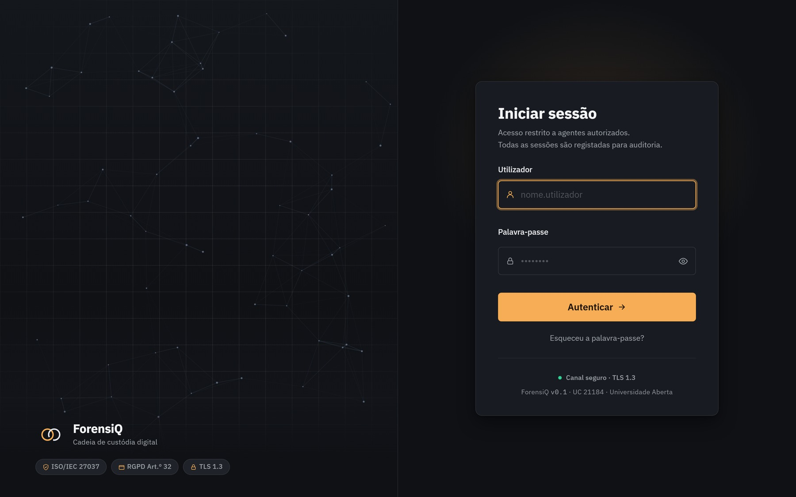

*Ecrã de entrada. O acesso é restrito a contas autorizadas e todas as sessões ficam registadas para auditoria.*

Para entrar, escreva o **Utilizador** e a **Palavra-passe** e clique em **Autenticar**. As contas de demonstração estão no apêndice [Contas de demonstração](#contas-de-demonstração); a palavra-passe comum é indicada aí. Após a autenticação, a aplicação leva-o ao painel.

> 📝 **Sessão e segurança**
> A sessão é mantida por um *cookie* seguro. O canal usa TLS 1.3 e a aplicação aplica uma política de segurança de conteúdo estrita. Para sair, use **Terminar sessão** no canto superior direito e confirme.

### A casca da aplicação

Depois de entrar, todos os ecrãs partilham a mesma estrutura: um cabeçalho no topo, a barra lateral de navegação à esquerda e a área de conteúdo ao centro, com um rodapé técnico.

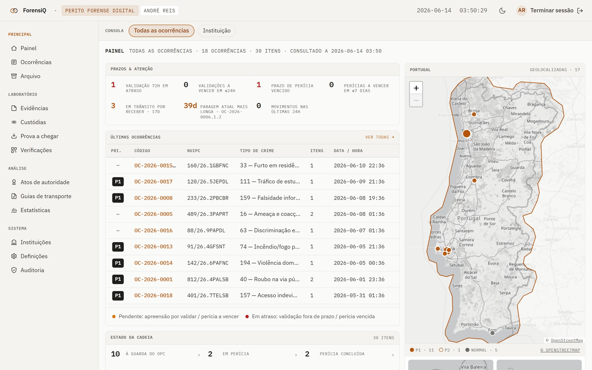

*A casca: cabeçalho (marca, perfil, nome, data e relógio, tema, sair), barra lateral em quatro grupos, área de conteúdo com a barra de lente, e rodapé técnico.*

- **Cabeçalho** — Mostra quem está autenticado — o perfil (ex.: **Perito forense digital**) e o nome — além da data, do relógio, do botão de tema (dia/noite) e de **Terminar sessão**.
- **Barra lateral** — Agrupa os destinos em quatro blocos: **Principal**, **Laboratório**, **Análise** e **Sistema**. Alguns itens só aparecem a quem tem a permissão respetiva (ver [Perfis e permissões](#perfis-e-permissões)).
- **Área de conteúdo** — Começa pela barra de lente (quando aplicável), seguida das migalhas de navegação e do conteúdo da página.
- **Rodapé** — Indica o estado da ligação, a versão da aplicação e o selo **CSP strict**.

### A lente: «As minhas» e «Instituição»

A *lente* (ou consola) escolhe o conjunto de processos com que está a trabalhar. Tem dois modos:

- **As minhas ocorrências** — os processos de que é titular. Quem tem leitura total vê este modo com o nome **Todas as ocorrências**.
- **Instituição** — todos os processos em que a sua instituição aparece na cadeia de custódia.

O seletor de lente só aparece a quem pertence a uma instituição. A escolha fica memorizada na sessão e propaga-se às listas. A lente é uma zona de trabalho, não uma fronteira de segurança: o que pode ver é sempre determinado pela sua função e credencial, descritas a seguir.

### Tema e definições

Em **Definições** (`/settings/`) escolhe o tema da interface — **Claro**, **Escuro** ou **Automático** (segue o sistema, alternando ao entardecer). A preferência fica guardada no seu navegador.

---

## Perfis e permissões

A combinação de *função* (o que faz) e *credencial* (até onde lê) determina o que cada conta vê e pode fazer. Os ecrãs são os mesmos para todos; mudam as ações disponíveis e o âmbito de leitura.

### As seis funções

- **Agente / Primeiro interveniente** — Quem está no terreno. Regista ocorrências e prova, e abre a cadeia de custódia. Vê os seus casos.
- **Perito forense digital** — Examina a prova. Tem leitura total *por função* — pode ser chamado a pronunciar-se sobre qualquer caso — e regista eventos de custódia nos itens que vê, incluindo o registo de atos de autoridade nos itens que detém ou examina. Não regista prova nova: a génese é do primeiro interveniente.
- **Custódio / Fiel depositário** — Guarda a prova. Regista eventos de custódia nos itens que detém ou que estão à guarda da sua instituição.
- **Autoridade judiciária (MP)** — Ordena. É a autoridade dos atos certificados — validar a apreensão, despachar para perícia, restituir, declarar a perda a favor do Estado —, nas ocorrências do seu serviço. Determina-os, em regra por despacho, e pode registá-los na aplicação; muitas vezes, porém, quem os regista é quem detém ou examina a prova, em seu nome (ver [Atos de autoridade](#atos-de-autoridade)).
- **Chefe de serviço** — Supervisiona. Lê o âmbito que a sua credencial permite, mas nunca escreve.
- **Auditor** — Fiscaliza. Como o chefe, é só-leitura; com credencial nacional, vê todo o trilho de auditoria.

### Credencial: Normal e Nacional

A credencial governa o alcance da leitura, de forma independente da função.

- **Normal (need-to-know)** — vê apenas o que lhe diz respeito: os seus casos, os itens que tocou, os processos da sua instituição.
- **Nacional (leitura nacional)** — leitura total, de toda a prova e todos os processos.

Há uma exceção a reter: o perito tem leitura total mesmo com credencial normal, porque a sua função o exige. E há um limite que nenhuma credencial ultrapassa: chefe e auditor nunca escrevem, por mais alargada que seja a credencial.

### Matriz de capacidades

| Função | Âmbito de leitura | Regista prova | Escreve custódia | Ordena atos |
|---|---|:---:|:---:|:---:|
| Primeiro interveniente | Os seus casos | ✓ | ✓ | ✗ |
| Perito forense | Total (por função) | ✗ | ✓ | ✗ |
| Custódio | O que detém / instituição | ✗ | ✓ | ✗ |
| Autoridade (MP) | Caso + serviço | ✗ | ✓ (só atos) | ✓ |
| Chefe de serviço | Conforme credencial | ✗ | ✗ | ✗ |
| Auditor | Conforme credencial | ✗ | ✗ | ✗ |

*O que cada função pode fazer. Registar um ato certificado é escrever na cadeia (coluna **Escreve custódia**): fá-lo quem detém ou examina o item; **Ordena atos** marca apenas quem é a autoridade que os determina. A credencial alarga a leitura; a escrita nunca depende dela.*

A lente inicial é **As minhas** para quase todos. Chefe e auditor entram em **Instituição**, porque a sua zona pessoal estaria vazia — não registam prova. As contas de demonstração e a lente em que cada uma abre estão no apêndice [Contas de demonstração](#contas-de-demonstração).

---

## Percursos por perfil

Esta secção mostra a sequência típica de cada função. Os detalhes de cada ecrã ficam na [Referência por funcionalidade](#referência-por-funcionalidade).

### Primeiro interveniente — do terreno à cadeia

> ⭐ **Exclusivo — Primeiro interveniente**
> Registar ocorrências e itens de prova é reservado a este perfil — a génese da prova capta-se onde ela é apreendida.

1. Em **Nova ocorrência**, registe o processo: NUIPC, tipo de crime e local.
2. No processo, use **Novo item** (ou **Adicionar sub-componente**) para registar cada prova. O assistente capta o tipo, o selo, a fotografia e a localização; a apreensão fica automaticamente lançada na cadeia.
3. Quando a prova tem de seguir para o laboratório, use **Encaminhar**: escolha o portador e o destino. A prova fica **em trânsito** até ser recebida.

### Autoridade judiciária (MP) — validar, ordenar, encerrar

> 📝 **A autoridade ordena; o registo pode ser de outrem**
> Validar a apreensão, despachar para perícia, restituir e declarar a perda a favor do Estado são *atos certificados*: cada um sela na cadeia a identidade da autoridade que o ordenou. A autoridade do caso (MP) determina-os nas ocorrências do seu serviço e pode registá-los na aplicação — mas o registo é, em regra, feito por quem detém ou examina a prova, em seu nome (ver [Atos de autoridade](#atos-de-autoridade)).

1. **Validar apreensão** certifica a apreensão dentro do prazo legal (72 h).
2. **Despacho p/ perícia** ordena o exame e fixa o prazo — é o que abre as portas do laboratório.
3. No fim, **Restituir** entrega a prova a quem de direito e encerra a cadeia.

### Perito forense — receber, examinar, concluir

1. Confirme a chegada da prova em **Prova a chegar** (`/inbound/`) e registe a **Receção**, anotando a condição do selo.
2. Na cadeia de custódia do item, registe o **Início de perícia** e, no fim, a **Conclusão de perícia**.
3. Use as **Verificações** para confirmar a integridade de qualquer item por *hash* ou QR.

### Custódio — guardar e movimentar

O custódio recebe, guarda e entrega prova. Trabalha sobretudo na lente **Instituição**, que lhe mostra os itens à guarda da sua casa (laboratório, tribunal, depósito), e regista receções e encaminhamentos dos itens que detém.

### Chefe de serviço e auditor — observar

Ambos os perfis são só-leitura. Entram na lente **Instituição** e percorrem processos, custódias e o trilho de auditoria sem qualquer botão de escrita. O auditor com credencial nacional vê todo o trilho; o chefe acompanha o seu serviço.

---

## Referência por funcionalidade

### Painel

O painel (`/dashboard/`) é o ponto de partida. Reúne quatro blocos: **Prazos a atenção** (validações e perícias a vencer ou vencidas), **Últimas ocorrências**, **Estado em cadeia** (a contagem de itens por estado legal) e o mapa de Portugal com a distribuição dos casos. Cada tijolo de prazo é um atalho: clicar leva à lista já filtrada pelo critério respetivo.

### Ocorrências

#### Lista de ocorrências

`/occurrences/` lista os processos. A barra de ferramentas tem pesquisa livre, ordenação e exportação CSV; cada coluna tem o seu filtro. As colunas são a prioridade, o código, o NUIPC, o tipo de crime, o número de itens e a data.

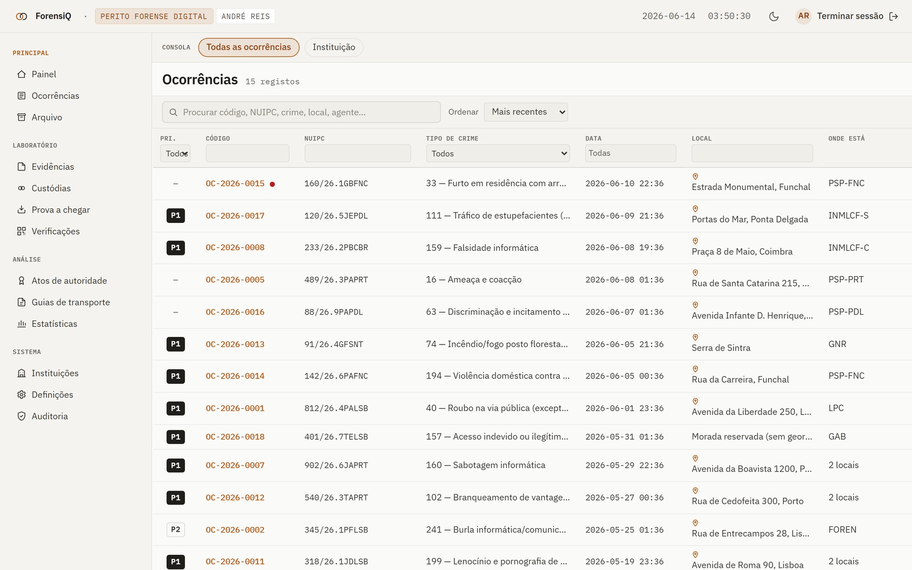

*Lista de ocorrências, com filtros por coluna. A prioridade distingue-se pelo peso (P1 cheio, P2 contorno), não por cor.*

> 📝 **Prioridade pela lei**
> A prioridade de cada caso deriva da natureza do crime, segundo a Lei de Política Criminal — não é atribuída à mão (salvo exceção justificada). Por isso aparece como **Prioritária (Derivada da lei)**.

#### Registar uma ocorrência

> ⭐ **Exclusivo — Primeiro interveniente**

Em **Nova ocorrência** (`/occurrences/new/`) preenche-se o NUIPC, a data e hora, o tipo de crime (escolhido numa cascata categoria → subcategoria → tipo), a descrição e o local (no mapa ou por coordenadas). Ao submeter, o processo é criado e abre o seu detalhe.

#### Detalhe da ocorrência (o *hub* do caso)

`/occurrences/<id>/` é o centro do processo. Reúne a ficha (NUIPC, crime, prioridade, agente, local com GPS), o mapa e a tabela de itens de prova com o estado legal de cada um e os marcadores de ato. No topo estão as ações disponíveis ao seu perfil: **Guia PDF**, **Despacho p/ perícia**, **Encaminhar**, **Restituir**.

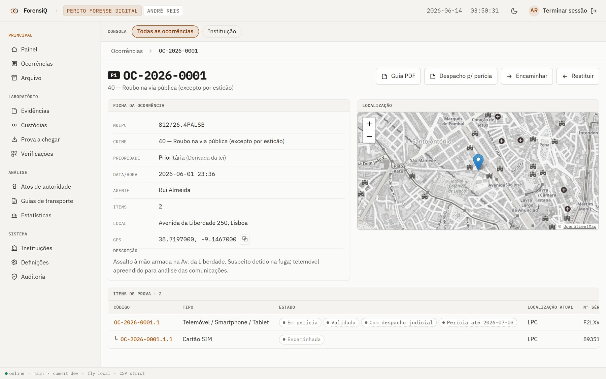

*Detalhe da ocorrência: ficha, mapa e itens de prova. Cada item mostra o estado legal e os atos (validado, com despacho, perícia até à data).*

#### Arquivo

`/arquivo/` reúne os processos concluídos — aqueles em que todos os itens chegaram a um estado terminal (restituída, destruída ou perdida a favor do Estado). Continua a poder consultar-se; registar atividade num processo arquivado é legítimo mas deliberado, e a aplicação avisa.

### Evidências

#### Lista de evidências

`/evidences/` lista os itens de prova. As colunas incluem o NUIPC, o código, a data de apreensão, o tipo, o equipamento (marca e modelo), o número de série, o detentor atual (**Onde está**) e o estado. A bolinha à esquerda do código resume o estado; um marcador adicional assinala pendências (apreensão por validar, perícia a vencer).

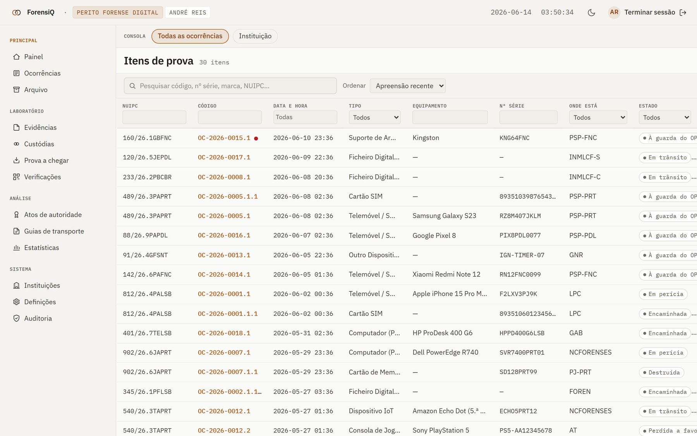

*Lista de itens de prova, com o detentor atual e o estado de cada um.*

#### Registar um item de prova

> ⭐ **Exclusivo — Primeiro interveniente**

O assistente (`/evidences/new/`) está organizado em blocos:

1. **Local da apreensão** — captura de GPS no mapa, ou coordenadas à mão.
2. **Contexto** — a **Ocorrência** e, se for o caso, o **Sub-componente de** (o item-pai).
3. **Identificação** — o **Tipo** (de entre dezoito; ver apêndice [Tipos de evidência](#tipos-de-evidência)), a **Fotografia**, a **Descrição** e os campos transversais (**Marca**, **Modelo**, **Estado de energia**, **Número de série**).
4. **Identificadores do dispositivo** — os campos próprios do tipo escolhido (IMEI, IMSI, VIN, MAC…), que aparecem conforme o tipo. Códigos de desbloqueio e PIN são mascarados.

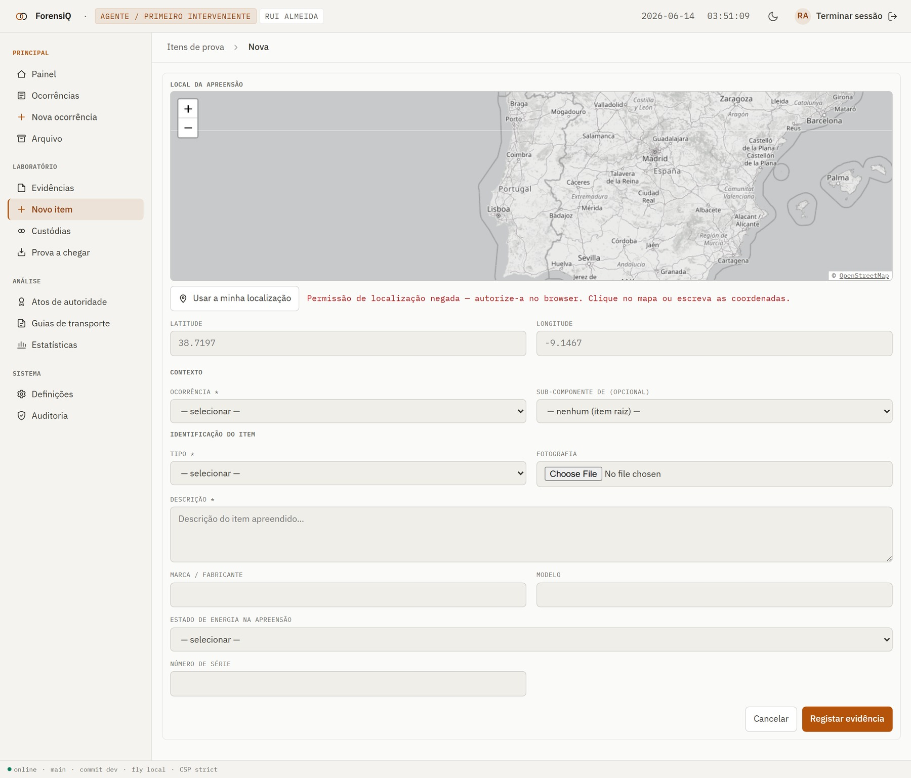

*Assistente de registo de item, em modo de criação. O conjunto de campos de identificação adapta-se ao tipo escolhido.*

Ao clicar em **Registar evidência**, o item é gravado, a apreensão é lançada na cadeia de custódia e calcula-se o *hash* de integridade. A aplicação leva-o então à página de continuação.

#### Continuar o registo (fluxo encadeado)

Depois de registar, a página de continuação (`/evidences/<id>/registado/`) evita repetir o contexto. Oferece **Registar sub-componente deste item**, **Outro componente de…** (se o item tem pai), **Registar outro item desta apreensão** e **Concluir — abrir a ficha do item**.

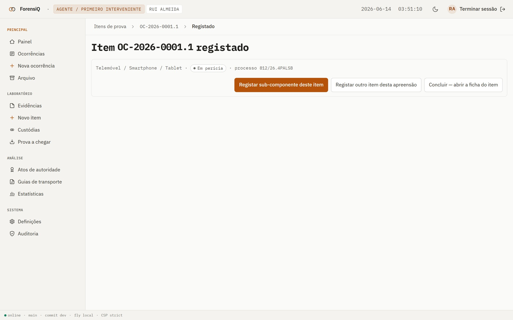

*Página de continuação: encadeia sub-componentes, irmãos ou novos itens sem reintroduzir a ocorrência.*

#### Ficha do item

`/evidences/<id>/` mostra tudo sobre um item: a fotografia, a situação atual (custódio, instituição, local, selo em vigor), o registo (tipo, estado, validação, despacho, ocorrência, série, apreensão, agente, *hash*), a selagem, os dados específicos do tipo e, à direita, o mapa do trajeto e a cadeia resumida. Os botões disponíveis dependem do perfil e do estado do item.

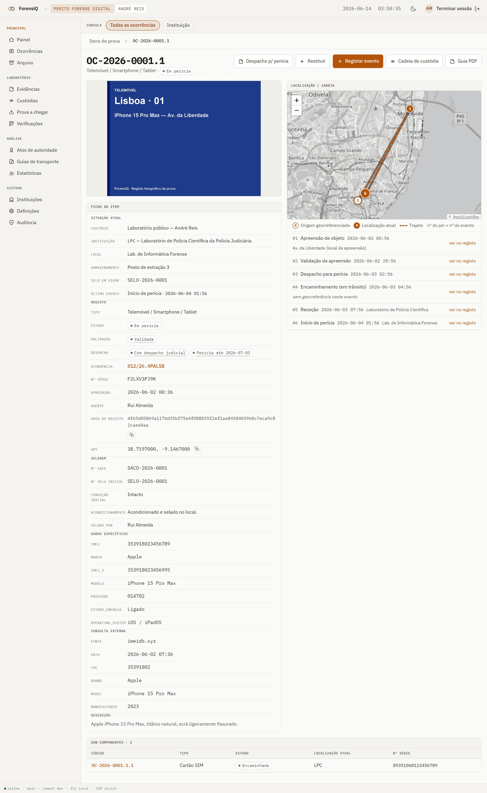

*Ficha do item: situação atual, registo com *hash*, e o trajeto no mapa com a cadeia de eventos.*

#### Sub-equipamentos (a árvore de prova)

Um item pode conter outros — um cartão SIM dentro de um telemóvel, um disco dentro de um computador. O ForensiQ representa isto como uma árvore, refletida no código: `OC-2026-0001.1` é um item-raiz e `OC-2026-0001.1.1` um seu sub-componente. O sub-componente herda a base legal do pai e a sua génese é o evento **Autonomizado do item-pai**.

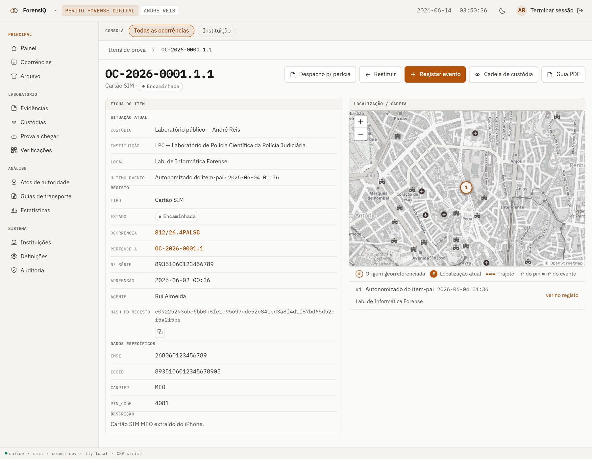

*Ficha de um sub-componente (cartão SIM). **Pertence a** liga ao item-pai; a base legal da apreensão consulta-se aí.*

> 📝 **Limites da árvore**
> A profundidade máxima é de três níveis. Quatro tipos não admitem sub-componentes (cartão SIM, cartão de memória, cartão RFID/NFC e ficheiro digital). Um item em trânsito ou com a cadeia encerrada também não os admite.

### Cadeia de custódia

#### A timeline do item

`/evidences/<id>/custody/` é o *ledger* oficial do item. O cabeçalho mostra o estado e as ações dedicadas; segue-se o formulário de registo de evento (apenas com os eventos que as regras aceitam a seguir) e, por fim, a lista cronológica.

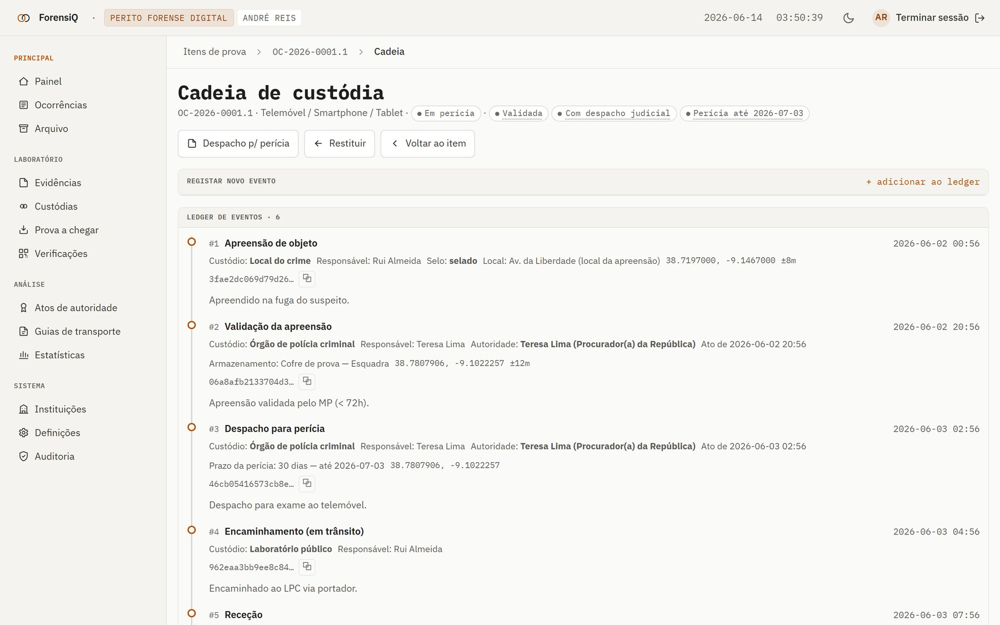

*Timeline da cadeia de custódia. Cada evento traz o custódio, o responsável, o selo, o GPS e o *hash* encadeado.*

#### Registar um evento

Na zona **Registar novo evento**, o campo **Tipo de evento** oferece só os eventos válidos. Conforme o evento, preenchem-se o **Custódio após o evento**, a **Instituição custódia**, o **Portador**, o **Local (POI)**, o **Armazenamento interno**, a geolocalização, a **Condição do selo na receção**, um **Novo n.º de selo** e **Observações**. Se o item tem sub-componentes abertos, pode aplicar o mesmo evento a toda a sub-árvore numa só operação atómica. Conclui-se em **Registar evento**.

> ⚖️ **Selo e integridade**
> A condição do selo na receção é decisiva. Um selo **Violado** dispara um alerta de integridade. Re-selar regista o novo número de selo. Tudo isto entra no *hash* do evento.

#### Estados e selos

O estado legal de um item é sempre calculado a partir do *ledger*. Os estados de localização e posse, e o eixo paralelo de validação, estão no apêndice [Estados da cadeia de custódia](#estados-da-cadeia-de-custódia); os tipos de evento e de custódio no apêndice [Eventos de custódia e custódios](#eventos-de-custódia-e-custódios).

#### Lista global de custódias

`/custodies/` reúne os eventos de custódia de todo o âmbito visível, com as colunas código, NUIPC, evento, custódio, instituição, responsável, estado atual, data e *hash*. Útil para seguir movimentos sem entrar item a item.

### Atos de autoridade

> 📝 **Quem ordena, quem regista**
> Os atos seguintes são *certificados*: registam quem foi a autoridade — nome e cargo — que os ordenou. A autoridade do caso (MP) determina-os; o registo na aplicação faz-se por quem tem escrita no item — o detentor (agente ou custódio), o perito que o examina, o *staff*, ou o próprio MP. Os perfis só-leitura (chefe, auditor) não os registam. Qualquer perfil com leitura pode *consultar* os atos já praticados.

#### Validar a apreensão

`/occurrences/<id>/validar/` certifica a apreensão. O formulário lista os itens com apreensão por validar (pré-selecionados, desmarcáveis) e pede a **Autoridade — nome**, o **Cargo**, a **Data e hora** e uma **Justificação** opcional. Conclui-se em **Validar apreensão**.

> ⚖️ **CPP art. 178.º/6**
> A validação tem um prazo legal de 72 horas a contar da apreensão. A aplicação assinala as apreensões por validar e as que ficaram fora do prazo.

#### Despachar para perícia

`/occurrences/<id>/despachar/` ordena o exame. O formulário acrescenta o **Prazo da perícia (dias)** aos campos da validação. Se algum item ainda tiver a apreensão por validar, a aplicação oferece incluir a validação no mesmo despacho, pela mesma autoridade e data.

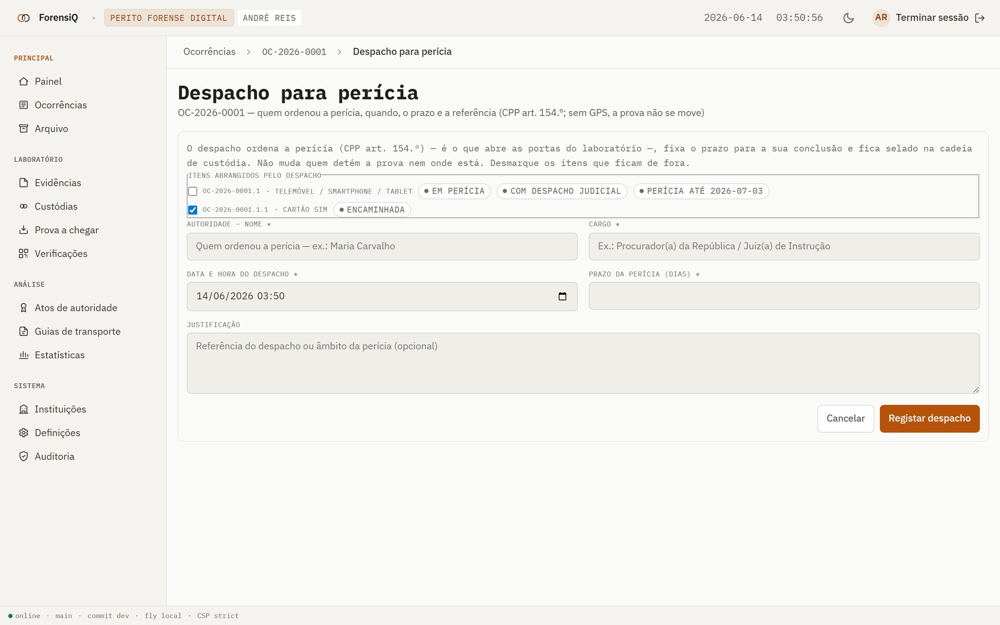

*Despacho para perícia: itens abrangidos, identidade da autoridade, data, **Prazo da perícia** e justificação.*

> ⚖️ **CPP art. 154.º e 158.º**
> O despacho abre as portas do laboratório — sem ele, um custódio de laboratório não admite a prova. Permite uma segunda perícia (novo despacho sobre item já examinado).

#### Consultar os atos de um item

`/evidences/<id>/atos/` mostra, sem editar, a validação e o(s) despacho(s) de um item: a autoridade, a data declarada, o prazo, quem registou e o *hash*. Abre-se também em janela a partir dos selos de ato nas listas.

#### Lista global de atos

`/atos/` reúne validações e despachos de todo o âmbito visível, com o item, o tipo de ato, a autoridade, a data declarada e o estado do prazo. O botão **Consultar** abre o detalhe do ato.

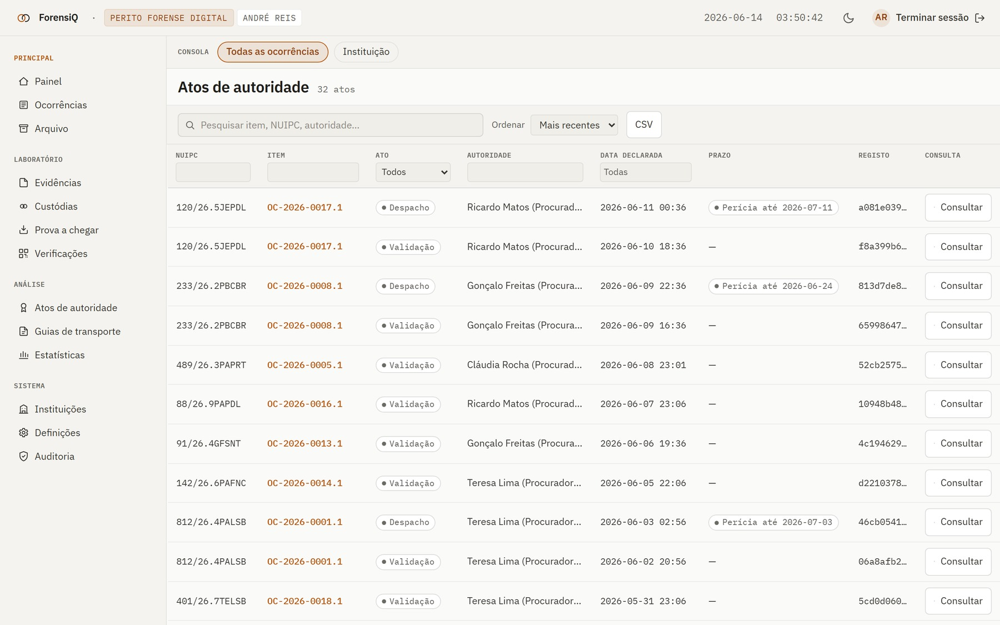

*Lista global de atos de autoridade — validações e despachos.*

### Transferência de prova

A prova move-se em dois tempos: quem entrega *encaminha*; quem recebe regista a *receção*. Entre os dois, a prova está em trânsito.

#### Encaminhar (entregar)

`/occurrences/<id>/encaminhar/` entrega prova a um portador, com destino a uma instituição. Selecionam-se os itens, escolhe-se o **Portador** (registado ou, em alternativa, um **Portador pontual** identificado à mão) e o **Destino**. Não há GPS — a prova está em movimento. Conclui-se em **Encaminhar**.

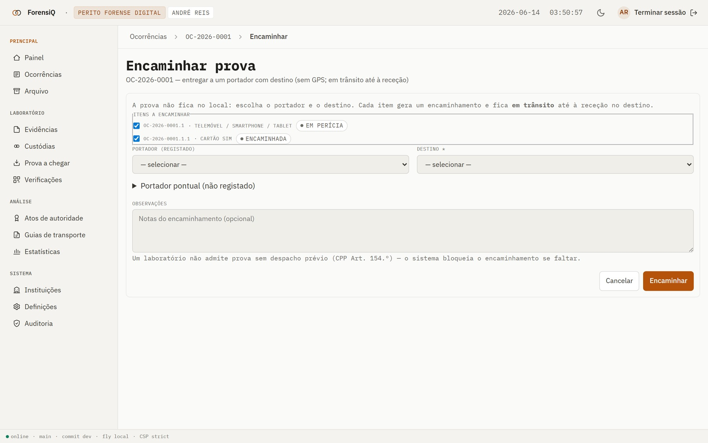

*Encaminhar prova: itens, portador e destino. O portador entra na cadeia de *hash*.*

> ⚖️ **Gate do laboratório**
> Um laboratório não admite prova sem despacho prévio. Se faltar o despacho, a aplicação bloqueia o encaminhamento para um destino de laboratório.

#### Prova a chegar (receber)

`/inbound/` é a caixa de entrada da instituição: os encaminhamentos dirigidos à sua casa, à espera de confirmação. O número ao lado do item de menu conta as receções pendentes.

#### Registar a receção

`/occurrences/<id>/intake/` fecha o trânsito. A tabela lista os itens a receber; para cada um em trânsito, regista-se a **Condição do selo** (Intacto, Partido, Violado, Ausente) e, se for o caso, um **Novo selo**. Em baixo indica-se o **Armazenamento interno** e **Observações**. Conclui-se em **Registar receção**.

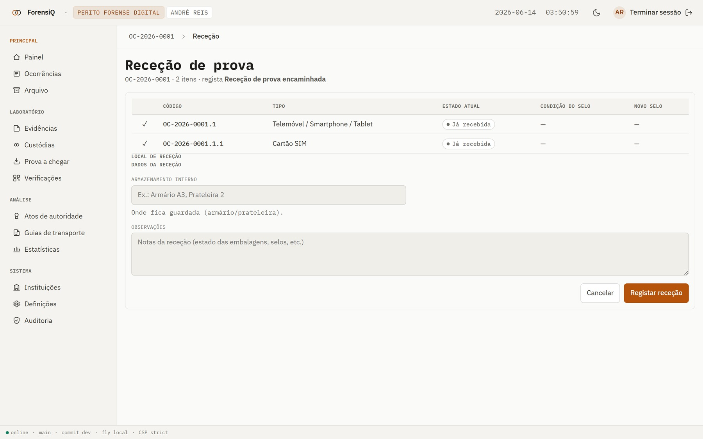

*Receção de prova: por cada item em trânsito, a condição do selo à chegada e um eventual novo selo.*

> 📝 **Quem pode receber**
> A receção está aberta a perito e *staff*, e a membros da instituição de destino com prova a chegar. Os perfis só-leitura não registam receções.

### Restituição

`/occurrences/<id>/restituir/` entrega a prova a quem de direito e encerra a cadeia — é definitiva. Registam-se a identidade do recetor (**Quem recebeu**, **Tipo de documento**, **N.º do documento**) e um **Fundamento** opcional. A identidade fica selada na cadeia de *hash*.

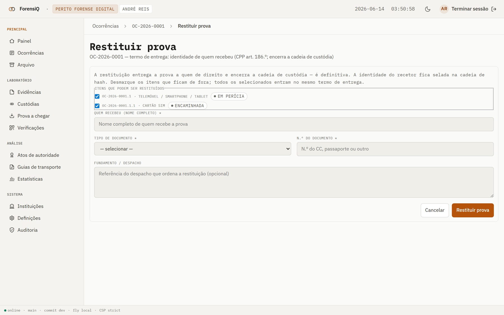

*Restituição: o termo de entrega regista a identidade de quem recebe a prova.*

> ⚖️ **CPP art. 186.º**
> A restituição é o termo de entrega. Encerra a cadeia de custódia do item: depois dela, não se aceitam mais eventos.

### Instituições

> ⭐ **Exclusivo — Credencial nacional**
> Criar e editar instituições é um ato de administração, reservado a contas com credencial nacional (e nunca aos perfis só-leitura).

`/institutions/` lista os pontos de controlo — esquadras, laboratórios, tribunais, serviços do MP, depósitos. Cada um tem nome, sigla, tipo, morada, contactos e coordenadas. As coordenadas importam: são herdadas pela prova na receção, quando não há GPS de terreno.

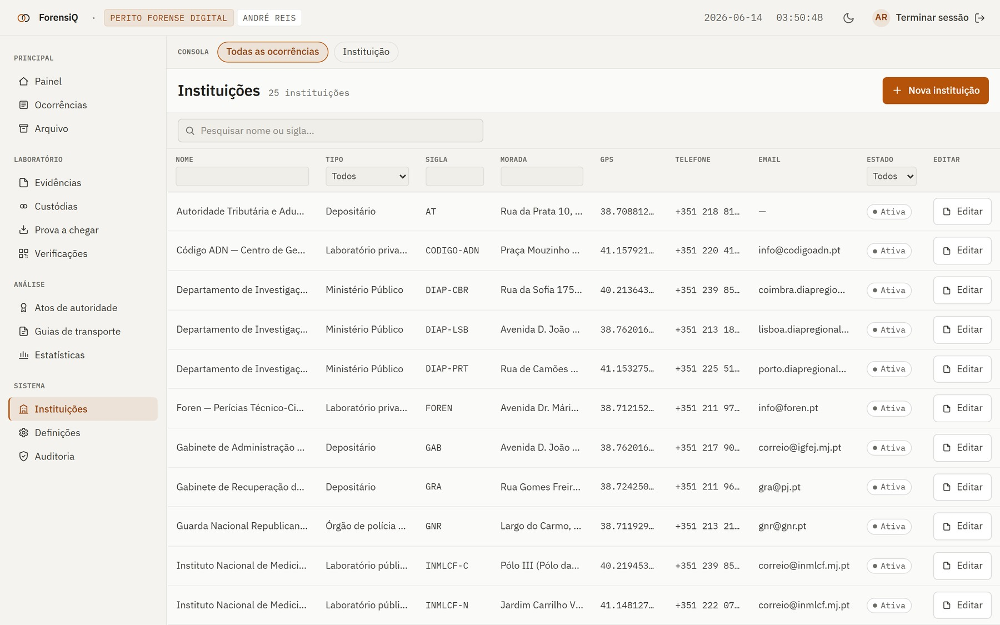

*Lista de instituições (pontos de controlo).*

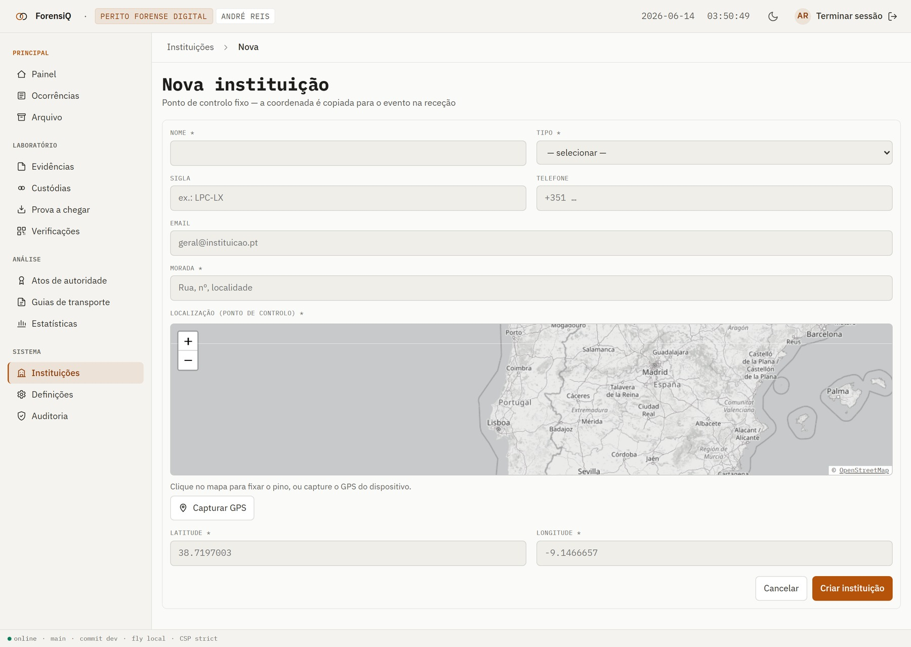

*Criar / editar uma instituição.*

### Verificações e verificação pública

#### Central de verificação

> ⭐ **Exclusivo — Perito / staff**

`/verificacoes/` resolve um *hash* ou um código de QR e *recalcula* a integridade da cadeia do item — confirma que os selos batem certo e que nada foi alterado. É a expressão prática da re-verificabilidade: o sistema não confia num estado guardado, recalcula-o.

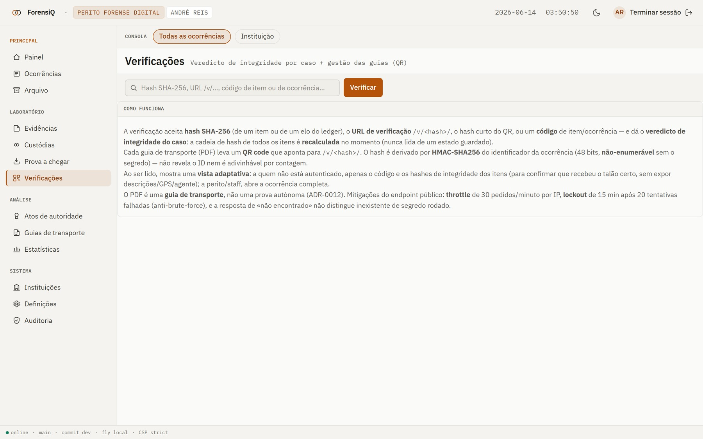

*Central de verificação: introduza um *hash* ou QR para recalcular a integridade da cadeia.*

#### Verificação pública por QR

`/v/<hash>/` é a única superfície sem sessão além da entrada. Os códigos QR das guias de transporte apontam para aqui: quem os lê vê uma confirmação *read-only* do essencial da guia. Um perito ou o dono do caso que abram o mesmo endereço já autenticados são reencaminhados para a vista completa.

### Auditoria

`/audit/investigation/` mostra o trilho — o registo *append-only* de todas as ações (criação, consulta, exportação) — e assinala anomalias na cadeia. Com credencial nacional, abrange todo o sistema; sem ela, mostra apenas os atos do próprio utilizador.

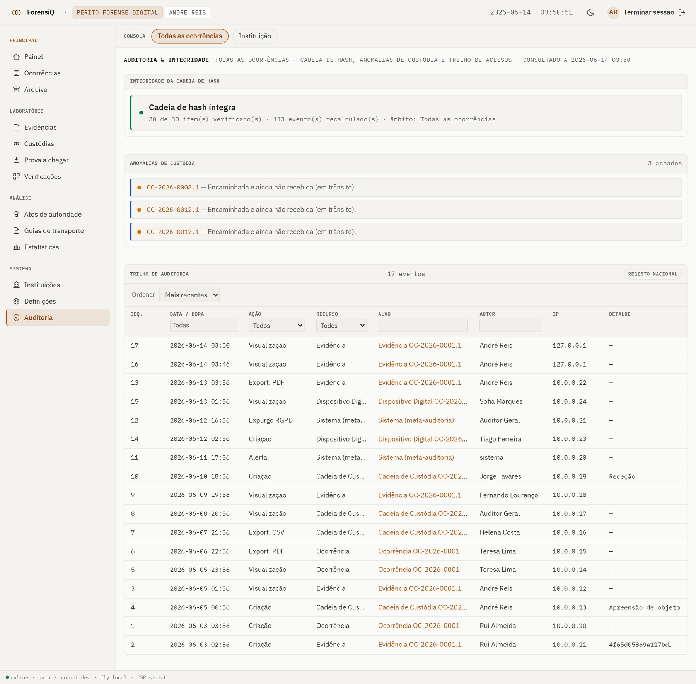

*Trilho de auditoria: integridade da cadeia, anomalias detetadas e o registo cronológico de acessos.*

### Estatísticas

`/stats/` reúne indicadores — contagens por estado, por tipo de crime, por instituição. Cada número é calculado para a janela temporal e a lente ativas, e o ecrã carimba ambas, para que se saiba sempre sobre que universo se está a contar.

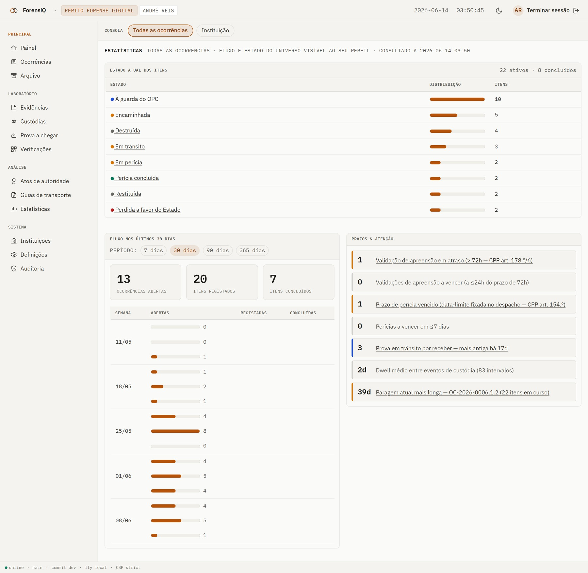

*Estatísticas, sempre carimbadas pela janela temporal e pela lente sob que foram calculadas.*

### Guias de transporte

`/reports/` gera as guias de transporte em PDF — o documento que acompanha a prova em trânsito, com os códigos QR que a verificação pública resolve. É um guia de transporte, não a prova: o valor probatório está na cadeia, não no papel.

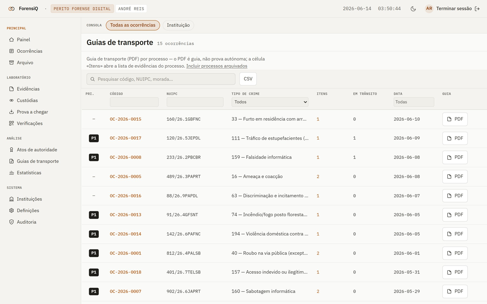

*Guias de transporte: a exportação em PDF que acompanha a prova, com QR de verificação.*

### Definições

`/settings/` reúne as preferências da conta — sobretudo o tema da interface (claro, escuro, automático). As escolhas ficam no navegador.

---

## Uso em telemóvel

A interface é desenhada primeiro para o ecrã estreito — o agente ou o perito no terreno. A barra lateral colapsa numa gaveta (o botão **Abrir navegação**), as listas reduzem-se às colunas essenciais e os alvos de toque cumprem o mínimo de acessibilidade.

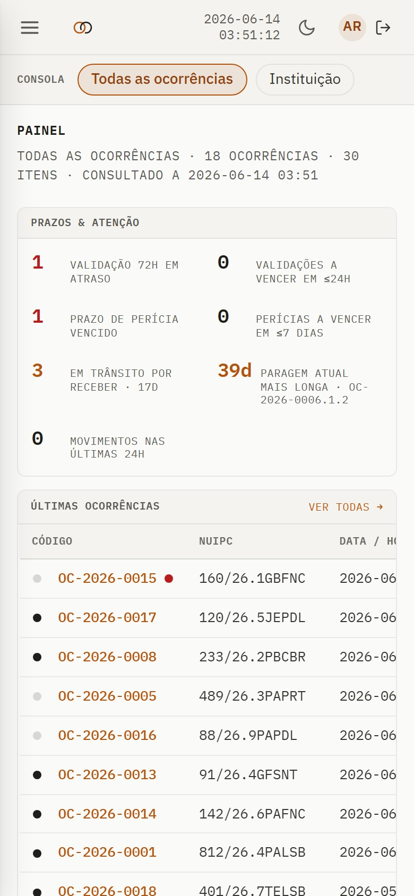
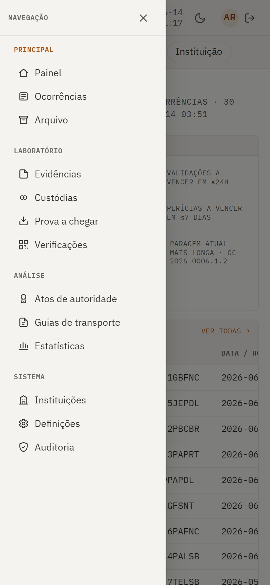
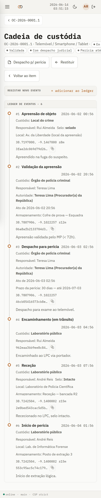

*Em telemóvel: painel reordenado, gaveta de navegação e cadeia de custódia adaptada.*

---

## Apêndices

### Contas de demonstração

As contas abaixo existem na instância de demonstração. A palavra-passe é comum a todas: `Forensiq#Demo2026`. São dados fictícios, para experimentar a aplicação.

| Utilizador | Função | Credencial | Abre na lente |
|---|---|---|---|
| `agente.lsb1` · `agente.lsb2` | Primeiro interveniente (PSP Lisboa) | Normal | As minhas ocorrências |
| `agente.prt1` · `agente.prt2` | Primeiro interveniente (PSP Porto) | Normal | As minhas ocorrências |
| `agente.far1` | Primeiro interveniente (GNR Faro) | Normal | As minhas ocorrências |
| `chefe.lsb` · `chefe.prt` · `chefe.far` | Chefe de serviço | Nacional | Tudo (só-leitura) |
| `perito.lpc1` | Perito forense (LPC) | Nacional | Tudo |
| `perito.lpc2` | Perito forense (LPC) | Normal | Tudo (leitura total por função) |
| `custodio.lpc` | Custódio (LPC) | Normal | À guarda da instituição (itens) |
| `perito.priv1` | Perito (laboratório privado) | Normal | Tudo |
| `custodio.priv` | Custódio (laboratório privado) | Normal | À guarda (itens) |
| `mp.lsb1` · `mp.lsb2` · `mp.prt1` | Autoridade do caso (MP) | Nacional | As minhas ocorrências |
| `escrivao.tj` | Custódio (tribunal) | Normal | À guarda (itens) |
| `auditor.geral` | Auditor nacional | Nacional | Tudo (só-leitura) |

*Contas de demonstração. Endereço: `https://forensiq.pt`.*

### Estados da cadeia de custódia

**Estados de localização / posse**

| Estado | Nota |
|---|---|
| À guarda do OPC | inicial |
| Em perícia | em exame no laboratório |
| Perícia concluída | exame terminado |
| Em trânsito | encaminhada, ainda não recebida |
| Encaminhada | entregue a custódio não-OPC |
| Restituída | terminal |
| Perdida a favor do Estado | terminal |
| Destruída | terminal |

**Eixo de validação**: Validada · Por validar · Validação em atraso.

**Condições de selo**: Intacto · Partido · Violado · Ausente.

Os três estados terminais fecham a cadeia: depois deles, o item não aceita mais eventos, e quando todos os itens de um processo são terminais, o processo passa ao Arquivo.

### Tipos de evidência

Os dezoito tipos de item de prova.

| Tipo | Identificadores próprios |
|---|---|
| Telemóvel / Smartphone / Tablet | IMEI, IMEI secundário, sistema operativo, código de desbloqueio |
| Cartão SIM | IMSI, ICCID, operador, PIN |
| Veículo (container) | VIN |
| Componente eletrónico de veículo | VIN do veículo associado |
| Equipamento de rede | MAC |
| Dispositivo IoT | MAC |
| Rastreador GPS | IMEI, IMSI |
| Localizador Bluetooth (AirTag / SmartTag / Tile) | ecossistema, n.º de série |
| Computador (PC / portátil / servidor) | sistema operativo, cifragem de disco |
| Disco interno (HDD / SSD / NVMe) | capacidade, interface |
| Suporte de armazenamento externo | capacidade |
| Cartão de memória (SD / microSD / CF) | capacidade |
| CCTV / DVR / NVR | n.º de canais, data/hora do sistema |
| Drone / UAV | n.º de série da aeronave |
| Consola de jogos | ID da consola |
| Ficheiro digital (captura) | dispositivo-fonte |
| Cartão RFID / NFC | UID do cartão |
| Outro dispositivo digital | categoria do dispositivo |

### Eventos de custódia e custódios

**Tipos de evento**

| Evento | Categoria |
|---|---|
| Apreensão de objeto | génese |
| Apreensão de dados informáticos | génese |
| Autonomizado do item-pai | génese (sub-comp.) |
| Validação da apreensão | ato certificado |
| Despacho para perícia | ato certificado |
| Início de perícia | subsequente |
| Conclusão de perícia | subsequente |
| Encaminhamento (em trânsito) | movimentação |
| Receção | movimentação |
| Restituição | terminal |
| Perda a favor do Estado | disposição |
| Destruição | terminal |

**Tipos de custódio**: Local do crime · Órgão de polícia criminal · Laboratório público · Laboratório privado · Tribunal · Depositário · Proprietário.

*Os atos certificados (validação e despacho) exigem a identidade da autoridade.*

### Base legal de referência

| Norma | Ato no ForensiQ |
|---|---|
| CPP art. 154.º / 158.º | Despacho que ordena a perícia; segunda perícia |
| CPP art. 178.º/6 | Validação da apreensão (prazo de 72 h) |
| CPP art. 186.º | Restituição da prova ao titular |
| Lei de Política Criminal | Prioridade do caso derivada do tipo de crime |
| ISO/IEC 27037 | Boas práticas de manuseamento de prova digital |

> 📝 **Nota final**
> Este manual descreve a aplicação tal como está. As capturas foram obtidas da instância de demonstração; pessoas, processos e moradas são fictícios.
